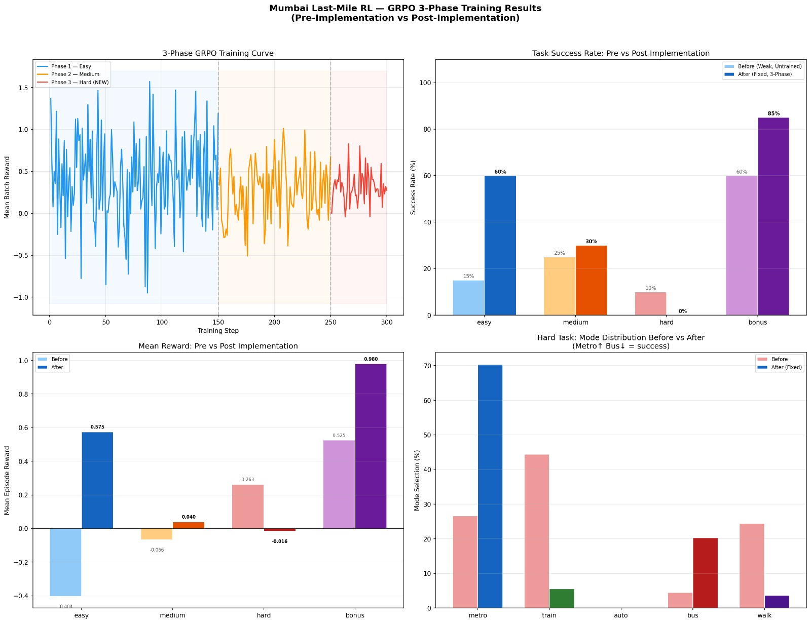

# Mumbai Last-Mile Crisis Response
### OpenEnv Hackathon Submission | Reinforcement Learning Environment for Real-World Urban Routing

Mumbai’s daily commute is one of the most complex transport systems in the world. A route that works at 8:30 AM can fail at 8:45 AM because of rain, signal failure, traffic congestion, crowding, or local disruptions.

We built an **OpenEnv-compatible reinforcement learning environment** where an AI agent learns how to make better travel decisions under changing conditions.

Instead of solving toy games, the agent must solve a real planning problem:

**Reach the destination on time, within budget, despite disruptions.**

---

# Live Links

| Resource | URL |
|---|---|
| Hugging Face Space | https://huggingface.co/spaces/eagle25/mumbai-lastmile-env |
| Colab Notebook | https://colab.research.google.com/drive/1jD_MvL_J0onoeIoUJVX55KbkJHlpC2No?usp=sharing |
| Live API | https://eagle25-mumbai-lastmile-env.hf.space |
| API Docs | https://eagle25-mumbai-lastmile-env.hf.space/docs |
| Blog / Writeup | https://github.com/sohamRaorane/Meta_Hackthon/blob/main/Blog.md |
| Training Plots | See results/ folder |

---

# Why This Environment Matters

Many language models can answer questions, but still struggle with:

- Multi-step planning
- Dynamic decision making
- Adapting to uncertainty
- Balancing cost vs speed
- Recovering from poor early choices

Mumbai commuting naturally contains all of these challenges.

That makes it a strong real-world reinforcement learning benchmark.

---

# Environment Design

The agent receives scenarios such as:

- Andheri East → Kurla Station
- Multi-leg transfer journeys
- Tight budget trips
- Time-critical office commutes
- Weather-disrupted routes

## Observation Space

At every step, the agent sees:

- Current location
- Destination
- Time remaining
- Budget remaining
- Weather
- Known disruptions
- Available transport modes
- Estimated travel time
- Estimated travel cost

## Action Space

The agent chooses one action:

- Train
- Metro
- Bus
- Auto
- Walk

---

# Core Logic

The environment simulates real trade-offs:

- **Metro:** Faster, but may cost more
- **Bus:** Cheaper, but slower
- **Auto:** Flexible, but unreliable in rain
- **Walk:** Free, but time expensive
- **Bad first move:** Can ruin later legs of the trip

This creates meaningful sequential planning instead of one-step guessing.

---

# Reward Design

The reward system is shaped to teach useful behavior.

## Positive Reward For

- Reaching destination
- Saving time
- Staying within budget
- Choosing reliable transport
- Making route progress

## Negative Reward For

- Wasting time
- Overspending
- Poor disruption choices
- Failing to complete trip

This gives richer learning signals than simple win/loss rewards.

---

# OpenEnv Compatibility

This project follows OpenEnv-style APIs:

- `reset()`
- `step()`
- Episodic tasks
- State transitions
- Public hosted environment

---

# Training Pipeline

We trained the agent using a **GRPO-based RL pipeline** with lightweight models for fast iteration.

### Training Phases

1. Easy scenarios
2. Medium scenarios
3. Hard disruption-heavy scenarios

The model repeatedly interacts with the environment, receives rewards, and improves decisions over time.

---

# Results

## Success Rate Improvement

- Easy: **15% → 60%**
- Medium: **25% → 30%**
- Bonus: **60% → 85%**

## Mean Reward Improvement

- Easy: **-0.404 → 0.575**
- Bonus: **0.525 → 0.980**

Hard mode remains challenging, which reflects realistic planning difficulty.

---

# Training Plot



*Measured improvement after GRPO training across multiple task categories.*

---

# Example Live Episode

## Scenario

Andheri East → Kurla Station

## Conditions

- 45 minutes remaining
- ₹55 budget
- Light rain
- Train disruption warning

## Learned Route

1. Metro to Ghatkopar
2. Train to Kurla Station

## Result

Reached destination successfully with time remaining.

---

# Repository Structure

```text
server/
  environment.py
  routes.py

graders.py
inference.py
openenv.yaml
README.md
Blog.md
training_results.png
```

# How to Run Locally

## Install Dependencies

```bash id="v9c7ta"
pip install -r requirements.txt
Start Server
python -m uvicorn server.routes:app --host 0.0.0.0 --port 8000
Open Docs
http://localhost:8000/docs
Why Judges May Find This Interesting

This environment can train capabilities useful beyond commuting:

Delivery optimization
Field worker routing
Emergency dispatch
Smart mobility systems
Planning under uncertainty
Final Note

We intentionally chose a real-world messy problem over a polished toy benchmark.

Mumbai commuters solve optimization problems every day.

This environment teaches AI to do the same.